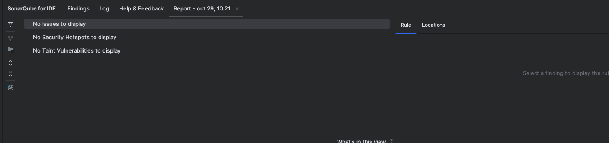

# Sistema de Gestion de Votaciones

API REST para gestionar votaciones de partidos politicos y candidatos

## Descripcion

Este sistema permite registrar partidos politicos, candidatos asociados a esos partidos, y llevar el conteo de votos recibidos por cada candidato. Tambien incluye endpoints para consultar estadisticas de votacion tanto por candidato como por partido

Desarrollado como parte de una evaluacion tecnica backend usando Spring Boot

## Instalacion

Clonar el repositorio:

```bash
git clone https://github.com/franjimenxz/evaluacion2-moby.git
cd evaluacion2-moby
```

Compilar el proyecto:

```bash
mvn clean install
```

## Ejecucion

Ejecutar la aplicacion:

```bash
mvn spring-boot:run
```

La aplicacion estara disponible en `http://localhost:8080`

## Documentacion de la API

Una vez la aplicacion este corriendo, podes acceder a la documentacion interactiva de Swagger en:

```
http://localhost:8080/swagger-ui.html
```

## Base de Datos

El proyecto usa H2 como base de datos en memoria. Se puede acceder a la consola H2 en:

```
http://localhost:8080/h2-console
```

Credenciales:
- JDBC URL: `jdbc:h2:mem:votacionesdb`
- Username: `sa`
- Password: (dejar vacio)

## Coleccion Postman

En la carpeta `/docs` estan la coleccion de Postman con todos los endpoints configurados

## Ejecutar Tests

Para correr todos los tests:

```bash
mvn test
```

El proyecto cuenta con 38 tests unitarios que cubren services y controllers


## Calidad de Codigo




https://imgur.com/8LTdkhk
(Se me rompe la imagen en GitHub)


## By

Franco Jimenez
